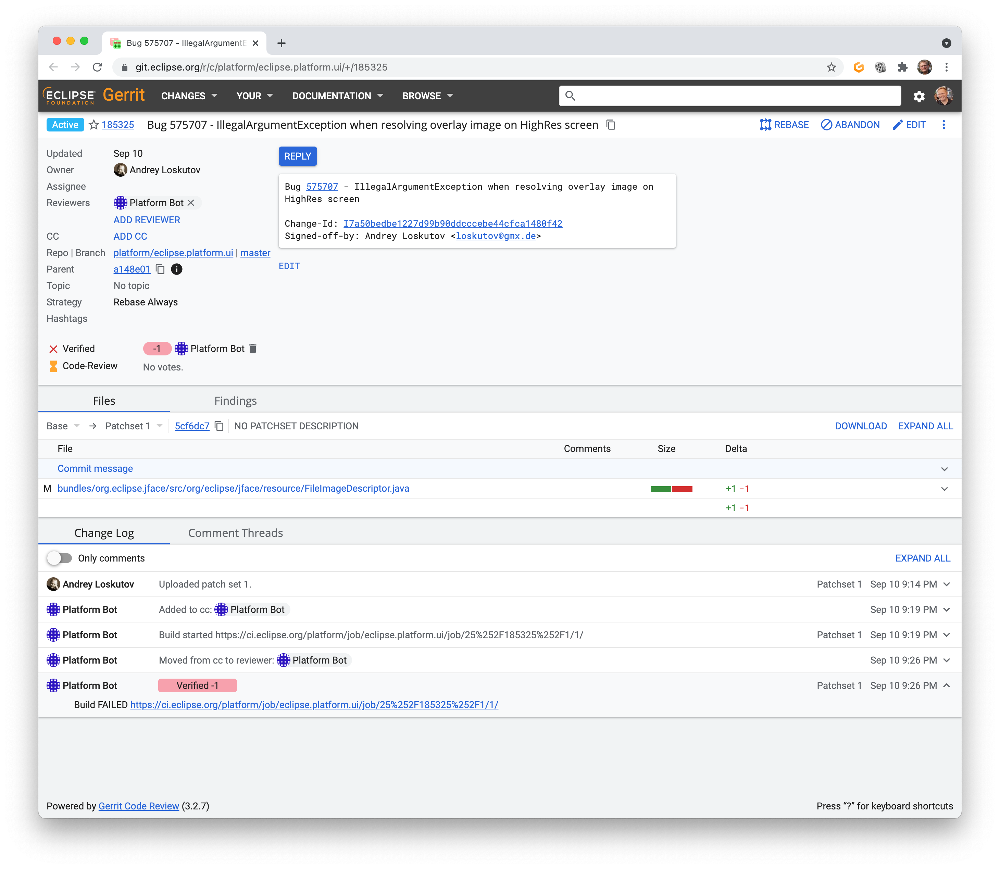
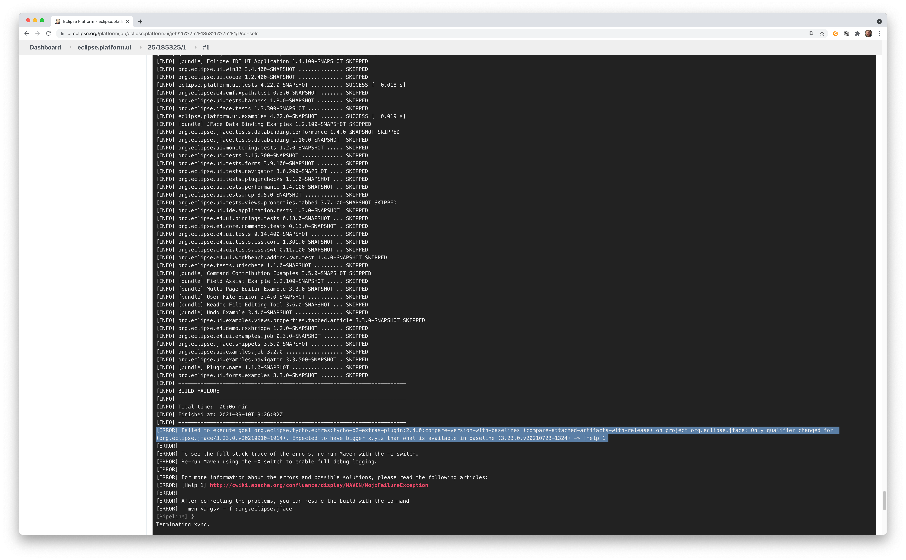

= eclipse-platform-versionbumper

:project-owner:   kthoms
:project-repo:    maven
:project-name:    eclipse-platform-versionbumper
:project-group:   de.kthoms.tools
:project-version: 0.3.0
:FINALNAME: eclipse-platform-versionbumper-0.3.0

image:https://github.com/{project-owner}/{project-name}/actions/workflows/maven.yml/badge.svg["Build Status", link="https://github.com/{project-owner}/{project-name}/actions"]
//image:https://img.shields.io/maven-central/v/de.kthoms.tools/eclipse-platform-versionbumper.svg[Download, link="https://search.maven.org/artifact/{project-group}/{project-name}/{project-version}/pom"]
image:https://img.shields.io/badge/license-EPL2.0-blue.svg["Eclipse Public License 2.0", link="https://www.eclipse.org/legal/epl-2.0/"]

A tool to provide version bump changes to Eclipse Gerrit for Eclipse Platform changes.

== Context

The Eclipse Platform Project follows a strict semantic versioning concept for all bundles contributed to its core projects.

With each simultaneous release the Eclipse Platform sets a new baseline based on its last release. 
Whenever a change is build it is first checked if affected bundles have the same version as the baseline bundle.
When this is the case, the Platform Bot sets `Verified -1` on the build and make it fail.

Then a developer needs to look up the build log on Jenkins and sees at the end of the console log an entry from the plugin `org.eclipse.tycho.extras:tycho-p2-extras-plugin` for the `compare-version-with-baselines`goal:

This indicates that a bundle needs a version bump for the bundle that it changes. This is a quite tedious work for platform developers as it requires for each change to

1) Check if it is required to bump a bundle version for a change
  This requires to look through the review queue and look into the logs of the last failed build if this was because of missing version bumping.

2) Identify which bundles for the changed files need to be bumped.
  A change could affect multiple bundles, but some of them might already have been bumped within the current release cycle. Bundles must not be bumped twice!

3) Rebase the change. With the version bumps a change is rebased.

== About this tool

This small tool aims to facilitate the version bumping for selected changes. For a given change (or multiple at once) it detects that a version bump is required.

The tool detects the project and repository a Gerrit change is for. The repository is cloned and the change checked out.

Based on the change the current Eclipse baseline version is determined. 
For this the tool reads the Eclipse parent POM `eclipse-platform-parent/pom.xml` from the `platform/eclipse.platform.releng.aggregator` repository.

Based on this information the latest maintenance branch name can be derived. 
When the Eclipse version on `master` is, for example, 4.22 then the maintenance branch from the previous version is `R4_21_maintenance`.

The maintenance branch is used to determine a bundle's version from the previous release. 
Based on this it can be detected if the version on the `master` branch is different (i.e. it is _bumped_) or not.

== Version Bump Strategies

To create the version bumps, there are 2 strategies:

1) Rebase the existing change upon the current master branch and amend the changes.

2) Create a separate change which only contains the version bumps and rebase the existing change upon the new change.
  This strategy keeps the actual change free from version updates. The version bumping is done by an atomic commit.

== How to use the tool

The tool is Java based and requires a Java runtime of version 11 or higher. It provides a command-line interface (CLI).

The tool is distributed as a single executable Jar file. Download `{FINALNAME}-jar-with-dependencies.jar` and execute it with

`java -jar {FINALNAME}-jar-with-dependencies.jar`

Without specifying further options this prints the tool's usage:

[subs="attributes"]
----
Usage: java -jar {FINALNAME}-jar-with-dependencies.jar [-hy] [--dryrun] -p=<password>
       -u=<user> [-c=<changeIds>]...

Create version bump changes for Eclipse Platform changes provided on the
Eclipse Gerrit server.

  -c, --changes=<changeIds>
                      List of Gerrit change ids to process
      --dryrun        Use this option to commit changes locally only without
                        publishing it to Gerrit.
  -h, --help          Display this help and exit
  -p, --password=<password>
                      Eclipse Gerrit Password
  -s, --strategy=<strategy>
                      Strategy how to provide version bump changes:
                      1) amend: Add version bump changes by amending to the
                        Gerrit change
                      2) rebase: Create a separate Gerrit change and rebase the
                        existing on upon the version bumping change
  -u, --user=<user>   Eclipse Gerrit User Id
  -y, --assume-yes    Assume 'yes' when asked for confirmation, e.g. to push
                        changes. Use this option for batch mode.
----

The options `-u`/`--user` and `-p`/`--password` are required to run the tool. 
The provided credentials are for your Gerrit user.

The `-c`/`--changes` option specifies the Gerrit change id(s) which are evaluated for a version bump.
When omitted the tool will ask for them.
